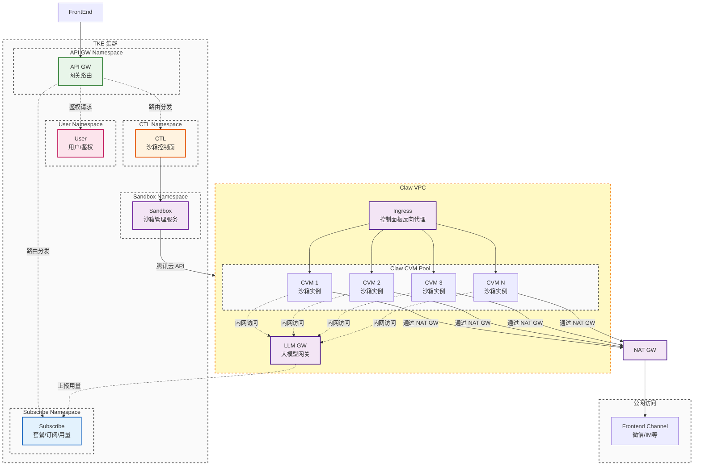

```mermaid
flowchart TD
    %% ===== 接入层 =====
    B[FrontEnd]
    B --> C[API GW]

    %% ===== TKE 集群 =====
    subgraph TKE["TKE 集群"]
        %% ===== API GW Namespace =====
        subgraph ApiGwNS["API GW Namespace"]
            C[API GW<br/>网关路由]
        end
        
        %% ===== User Namespace =====
        subgraph UserNS["User Namespace"]
            F[User<br/>用户/鉴权]
        end
        
        %% ===== Subscribe Namespace =====
        subgraph SubscribeNS["Subscribe Namespace"]
            D[Subscribe<br/>套餐/订阅/用量]
        end
        
        %% ===== CTL Namespace =====
        subgraph CTLNS["CTL Namespace"]
            E[CTL<br/>沙箱控制面]
        end
        
        %% ===== Sandbox Namespace =====
        subgraph SandboxNS["Sandbox Namespace"]
            G[Sandbox<br/>沙箱管理服务]
        end
        
        %% ===== 跨 Namespace 调用 =====
        C -.->|路由分发| D
        C -.->|路由分发| E
        C -.->|鉴权请求| F
    end
    
    %% ===== Sandbox 管理链路 =====
    E --> G

    %% ===== Claw VPC =====
    subgraph ClawVPC["Claw VPC"]
        direction TB
        
        subgraph ClawCluster["Claw CVM Pool"]
            I1[CVM 1<br/>沙箱实例]
            I2[CVM 2<br/>沙箱实例]
            I3[CVM 3<br/>沙箱实例]
            I4[CVM N<br/>沙箱实例]
        end
        
        O[LLM GW<br/>大模型网关]
        
        L[Ingress<br/>控制面板反向代理]
        
        L --> I1
        L --> I2
        L --> I3
        L --> I4
    end
    
    %% ===== Sandbox 连接到 Claw VPC =====
    G -->|腾讯云 API| ClawVPC

    %% ===== 公网访问链路 =====
    subgraph PublicNetwork["公网访问"]
        J[Frontend Channel<br/>微信/IM等]
    end
    
    I1 -->|通过 NAT GW| M[NAT GW]
    I2 -->|通过 NAT GW| M
    I3 -->|通过 NAT GW| M
    I4 -->|通过 NAT GW| M
    M --> J

    %% ===== 内网访问链路 =====
    I1 -.->|内网访问| O
    I2 -.->|内网访问| O
    I3 -.->|内网访问| O
    I4 -.->|内网访问| O

    %% ===== LLM GW 上报链路 =====
    O -.->|上报用量| D

    %% ===== 样式 =====
    classDef apigw fill:#e8f5e9,stroke:#2e7d32,stroke-width:2px
    classDef user fill:#fce4ec,stroke:#c2185b,stroke-width:2px
    classDef subscribe fill:#e3f2fd,stroke:#1565c0,stroke-width:2px
    classDef ctl fill:#fff3e0,stroke:#e65100,stroke-width:2px
    classDef sandbox fill:#f3e5f5,stroke:#6a1b9a,stroke-width:2px
    classDef network fill:#f3e5f5,stroke:#4a148c,stroke-width:2px
    classDef cluster fill:#fafafa,stroke:#424242,stroke-width:2px,stroke-dasharray: 5 5
    classDef vpc fill:#fff9c4,stroke:#f57f17,stroke-width:2px,stroke-dasharray: 5 5
    
    class C apigw
    class F user
    class D subscribe
    class E ctl
    class G sandbox
    class M,L,O network
    class TKE cluster
    class ClawVPC vpc
```